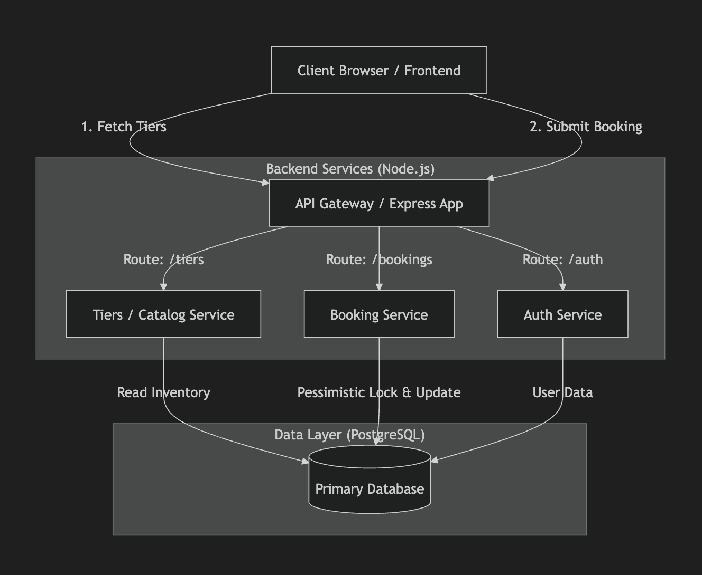

# Concert Booking System Architecture & Scaling

## Architecture Diagram

## Failure Scenarios

1.  **Payment Gateway Outage (Simulated 10% Failure Rate)**
    *   **Impact**: Users cannot complete their bookings. Inventory is temporarily locked but released when the transaction rolls back.
    *   **Mitigation**: Implement retry mechanisms with exponential backoff on the client side. Ensure idempotency keys prevent double-charging if a payment is retried.
2.  **Database Connection Pool Exhaustion**
    *   **Impact**: Under high load (e.g., ticket drops), the backend runs out of connections to the database, causing requests to time out and fail.
    *   **Mitigation**: Use a connection pooler like PgBouncer. Tune the application's connection pool size.
3.  **Database Deadlocks or Lock Contention**
    *   **Impact**: During massive simultaneous requests for the exact same tier, pessimistic locking (`SELECT ... FOR UPDATE`) causes queries to queue up. If timeouts are reached, transactions fail.
    *   **Mitigation**: Keep transactions as short as possible. Move non-critical steps (like external API calls or email sending) outside the database transaction.

## Scaling Plan

To handle high traffic events ("Ticket Drops"):

1.  **Read-Heavy Traffic (Catalog Browsing)**:
    *   Implement **Read Replicas** for the PostgreSQL database so that browsing the catalog doesn't hit the primary instance.
    *   Introduce a caching layer (e.g., **Redis**) to serve the initial catalog and tier availability data. This cache can be updated asynchronously or via short TTLs.
2.  **Write-Heavy Traffic (Bookings)**:
    *   **Horizontally Scale the Backend**: Run multiple instances of the Node.js application behind a Load Balancer to distribute incoming HTTP requests.
    *   **Database Partitioning/Sharding**: If the database becomes the bottleneck for writes, shard the data (potentially by event ID or region).
3.  **Asynchronous Processing**:
    *   Move from synchronous booking to an asynchronous queuing model. When a user requests a ticket, put the request on a message queue (Kafka/RabbitMQ) and process it in the background, returning a "Pending" status to the frontend.

## 3 Production Improvements

1.  **Redis + Lua Scripting for Inventory Management**
    *   *Why*: Relying solely on PostgreSQL pessimistic locking for high-concurrency ticket drops can overwhelm the database. Moving the initial seat deduction to Redis using atomic Lua scripts allows for dramatically higher throughput. The database can then be updated asynchronously or via a reliable queue.
2.  **Decouple Payment Processing with Webhooks**
    *   *Why*: Currently, the payment is simulated inline within the database transaction. In production, calling a third-party payment provider (like Stripe) inside an open database transaction is an anti-pattern (it keeps the connection and locks held during network latency). We should reserve the ticket, close the transaction, initiate the payment session, and fulfill the booking asynchronously via a webhook upon success.
3.  **Implement Distributed Tracing & Telemetry**
    *   *Why*: When a booking fails or is slow in a distributed system, it's hard to know why. Integrating OpenTelemetry for distributed tracing allows us to see exactly how much time is spent in the Auth middleware, the database lock, and the payment simulation, making debugging and performance optimization significantly easier.
